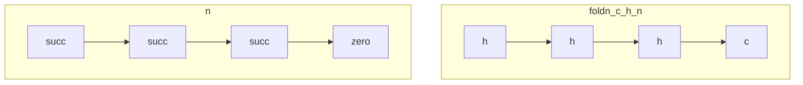
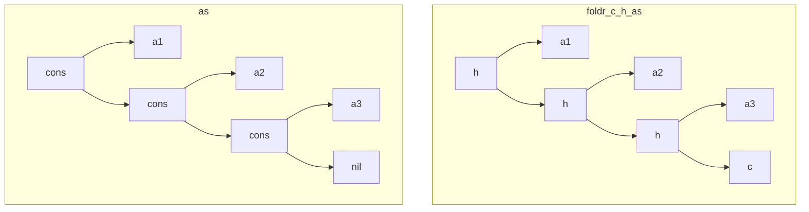
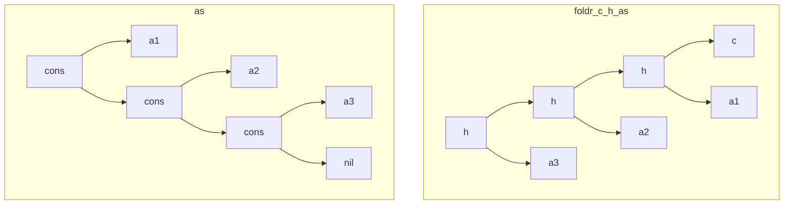

# AoP 1 - Programs

###### tags: `cat` `fp` `Bird`

> *Most of the derivations recorded in this book end with a program, more specifically, a **functional programs**.*
> 
---

[TOC]

---

## 1.1 Datatypes

* Datatypes introduced by simple enumeration
    1. ***Bool*** w/constructors: *false*, *true*
    2. ***Char*** w/constructors: *ascii0*, *ascii1*, *ascii2*, ... 

> [Alias]: 'A' = *ascii65*, '\n' = *ascii10*, ...

* Datatypes introduced in terms of others

    3. ***Either*** *Bool* *Char* w/constructors: *bool*, *char*
    4. ***Both*** *Bool* *Char* w/constructors: *tuple* (or `(,)`)

> [Note]
> `curry ∷ ((AxB) → C) -> A → B → C`
> `curry f a b = f (a,b)`
> 

> In FP, we prefer curried functions.
> In theoretical treatment, we prefer pairs.

* Datatypes parameterised by other types

    5. *maybe* A = *nothing* | *just* A

## 1.2 Natural Numbers

* Datatypes defined recursively

    6. *Nat* = *zero* | *succ* *Nat*

> [Alias]
> 0 = *zero*,
> n + 1 = *succ* n, ...
> 

The **recursion scheme**:

> The equations
> 
> ```Haskell
> f 0 = c
> f (n + 1) = h (f n)
> ```
> uniquely define a function *f* :: *A* <- *Nat* for every const *c* :: *A* and function *h* :: *A* <- *A*

(called the *structural* recursion over the natural numbers.)

> [Alias] We write *f = foldn(c,h)*
> 


* *foldn* is called the *fold* operator for the type *Nat*
* *foldn* describes a *homomorphism* of *Nat*
* Not every computable function over *Nat* can be described using structural recursion.


$$
\left\{\begin{matrix}
f \circ 0 & = & c \\ 
f \circ succ & = & h \circ f 
\end{matrix}\right.
$$



```Haskell
plus m = foldn (m, succ)
mult m = foldn (0, plus m)
expn m = foldn (1, mult m)

fact = outr . foldn ((0,1),h)
   where h(m,n) = (m + 1,(m + 1) * n)
   
fib = outl . foldn ((0,1),h)
   where h(m,n) = (n, m + n)
```

> Here, the `(m,n)`s are called *table*.
> 


More examples:
```Haskell
-- ex. 1.4 the squaring function
sqr :: Nat -> Nat
sqr = outl . foldn ((0,0), h)
  where h (sum, dn) = (sum + dn + 1, dn + 2)
```
```Haskell
-- ex. 1.5
last p :: Nat -> Nat
last p = outl . foldn ((0,0), h)
  where h (pn, n) = (n + 1, n + 1), if p (n + 1)
                  = (pn, n + 1), o.w.
```

## 1.3 Lists

* (Datatypes defined recursively)

    7. *listr A = nil | cons (A, listr A)*
    8. *listl A = nil | snoc (listl A, A)*

> [Alias]
> *nil = []*
> *cons (a,as) = a : as*
> *cons (a,nil) = [a]*
> *cons (a, cons (b, nil)) = [a b]*
> ...
> 

The concatenation *⧺ :: listr A <- listr A x listr A*:
* *[1,2,3] ⧺ [4,5] = [1,2,3,4,5]*
* *cons (a,as) = [a] ⧺ as*
* Define *⧺* for cons-list:
    ```Haskell
            nil ++ x = x
    cons (a, y) ++ x = cons (a, y ++ x)
    ```
* ;then it can be showed that:
    * *nil* is both left and right identity for *⧺*.
    * *⧺* is associtive.

The map *listr 𝜙 :: listr A' <- listr A*, where *𝜙 :: A' <- A*

* Informally *listr 𝜙 [a1,a2,...] = [𝜙 a1,𝜙 a2,...]*
* Recursive definition:
    ```Haskell
              listr 𝜙 nil = nil
    listr 𝜙 (cons (a,as)) = cons (𝜙 a, listr 𝜙 as)
    ```
    
The recursive scheme for cons-list

* The scheme:
    * *f :: B <- listr A*
    * *c :: B*
    * *h :: B <- A x B*
    ```Haskell
               f nil = c
    f (cons (a, as)) = h (a, f as)
    ```
* The fold:
    ```Haskell
               foldr (c, h) nil = c
    foldr (c, h) (cons (a, as)) = h (a, foldr (c, h) as)
    ```
    *foldr (c, h)* embody structural recursion on a list by systematically replacing *nil* by *c* and *cons* by *h*.

* Examples:
    ```Haskell
    listr f = foldr (nil,h)
        where h (a,b) = cons (f a, x)
        
    cat = foldr (id, h)
        where h (a,f) x = cons (a, f x)
    
    sum = foldr (0, plus)
    product = foldr (1, mult)
    concat = foldr (nil, cat)
    length = sum . listr one, where one a = 1
    
    filter p = foldr (nil, (p . outl -> cons,outr))
    ```
> [Note]
> `lentgh = foldr (0, h), where h(a,n) = n + 1`
> *Any function which can be expressed as a fold after a mapping can also be expressed as a single fold.*
> 

The basic view of lists in most FP is cons-lists, therefore, the definition of snoc-list *foldl :: B <- listl A* can be modified for
* *foldl :: B <- listr A*
    ```Haskell
    foldl (c,h) nil = c
    foldl (c,h) (cons (a,x)) = foldl (h (c,a), h) x
    ```
* Remark:
    1. This is an *iterative definition*.
    2. The first component of the first argument of *foldl* is treated as an **accumulation parameter**, modeling the state of an imperative program.
    3. This *foldl* is exactly the `reduce` in most programming languages.
    4. This *foldl* could also be defined in terms of cons-list's intrinsic *foldr*.!


```JavaScript
// { cons: (1 (2 (3 (4 ())))) }
S.reduce (...) ('e') (cons) //=> ((((e * 1) * 2) * 3) * 4)
```
* Examples:
    ```Haskell
    reverse = foldl (nil, prepend)
         where prepend (as, a) = cons (a, as)
    ```
        
## 1.4 Trees

* (Datatypes defined recursively)

    9. *tree A = tip A | bin (tree A, tree A)*
    10. tree and forest:
        * *tree A = fork (A, forest A)*
        * *forest A = null | grow (tree A, forest A)*

The general idea:
> When introducing a new **datatype**, also define the generic **fold** operation for that datatype.
> When the datatype is **parameterised**, also introduce the appropriate **mapping** operation.
> Given these functions, a number of other useful functions can be quickly derived.
>

## 1.5 Inverses
## 1.6 Polymorphic Functions

*  Some of the list-processing functions are polymorphic in that they do not depent in any essential way on the particular type (*A, B, ...*) of lists being considered. 


| Signature                                 | Polymorphic                                      |
| ----------------------------------------- | ------------------------------------------------ |
| *concat : listr A <- listr (listr A)*     | *listr f . concat = concat . listr (listr f)*     |
| *inits : listl (listl A) <- listl A*      | *listl (listl f) . inits  = inits . listl A*     |
| *reverse : listr A <- listr A*            | *listr f . reverse = reverse . listr f*           |
| *zip : listr (AxB) <- listr A x listr B*  | ...                                              |


## 1.7 Pointwise and Point-free
