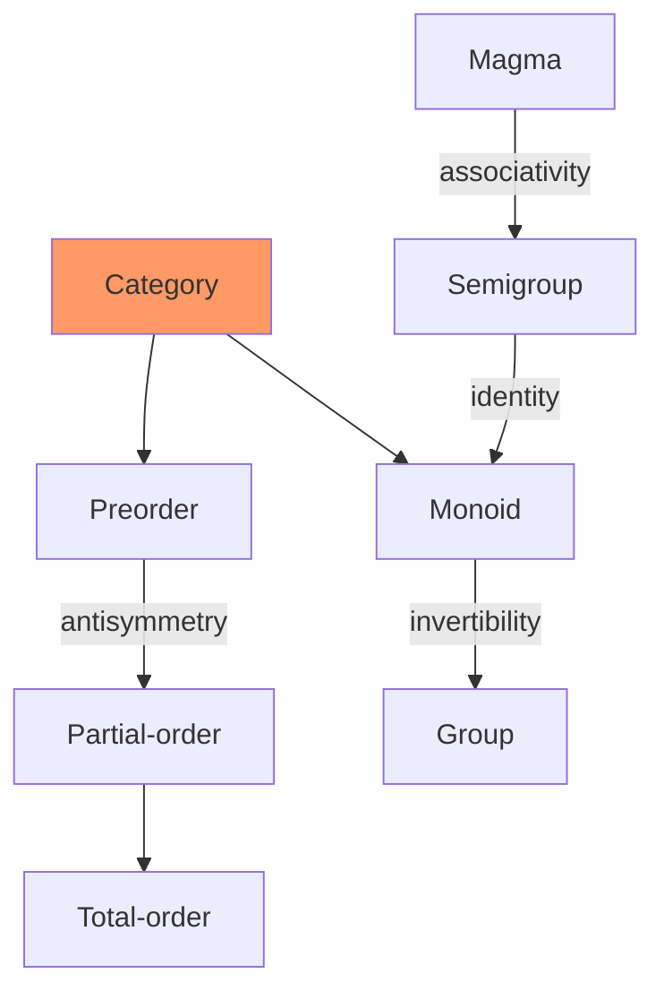
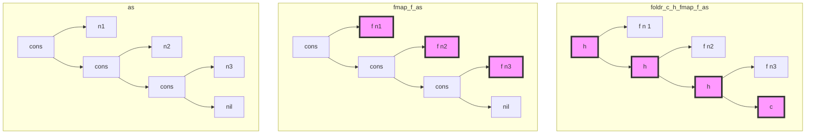

# AoP 2 - Functions and Categories

###### tags: `cat` `fp` `Bird`

> *One does not so much learn category theory as absorb it over a period of time.*
---

[TOC]

---

## 2.1 Categories

### Definition $\mathcal{C}$

1. Noun
    1. *objects*, *dots*: $Obj(C)$, $C_0$
    2. *morphisms*, *arrows*: $Mor(C)$, $C_1$
    3. \`pairs\` of morphisms: $C_2$.
2. Verb
    1. A pair of total operations, $s,t : C_1 \rightrightarrows C_0$
    2. A total operation, $id :C_0 \rightarrow C_1$
    3. A partial operation, $\circ : C_2 \rightarrow C_1$
3. Law
    1. $f \circ g$ is defined for $t\cdot g = s\cdot f$
    2. Associativity for $\circ$
    3. Identity for $\circ$, $id$
4. Commutativity
    * 

---


> [Notation]
> We will denote a morphism $f$ with $A = t(f)$ and $B = s(f)$ by $f : A \leftarrow B$ and sometimes more succintly by $f_{AB}$
> 

---

### Examples


1. Shapes
    * **1**, the "object" 
    * **1** + **1**, the "pair" 
    * **2**, the "arrow", 
    * **I**, the "isomorphism", 
    * Oridinal categories
2. Preorders
3. Monoids
4. **Fun**/**Set**, **Par**, **Rel**, ...
5. Product of Categories: $\mathcal{C} \times \mathcal{D}$
6. The arrow category: $\text{Arr}(\mathcal{C})$




## 2.2 Functors

> A *functor* is a homomorphism between categories
> 


> Functors themsolves forms a category:
> * Functors can be composed as $(F \cdot G)f = F(Gf)$
> * For every category $\mathcal{C}$, there is an identity function $id : \mathcal{C} \leftarrow \mathcal{C}$
> 

### Examples

1. For $\mathcal{C}$, the identity function $id: C \leftarrow C$.
2. For categories $\mathcal{A}, \mathcal{B}$, $A \in Obj(\mathcal{A})$, the *constant functor* $K_A : \mathcal{A} \leftarrow \mathcal{B}$
3. The *product* (bi)functor $(\times) : \text{Fun} \leftarrow \text{Fun} \times \text{Fun}$


## 2.3 Natural Transformations

> *I didn't invent categories to study functors; I invented them to study natural transformations.*
> 

Recall:

0. Objects: $A, B, C, ...$
1. Morphism $f$: Point $B$ $\leadsto$ Point $A$
2. Functor $F$: Line  $\leadsto$ Line 
3. Natural Transformations: Plain $S$ $\leadsto$ Plain $T$ 
    * $\tau$ maps object $a$ to morphism $\tau_a$
    * $\tau$ maps morphism $f$ to commutative diagram: 

## 2.4 Constructing Datatypes

### Terminal Objects $1$

> A *terminal object* in a category $\mathcal{C}$ is an object $1$ such that for every object $A$ in $\mathcal{C}$ there is a unique morphism from $A$ to $1$, denoted by $!_A : 1 \leftarrow A$.
> 

> [Notation]
> $1$ will denote some fixed terminal object, and we will speak of **THE** terminal object.
> 

1. The *reflection* law: $!_1 = id_1$
2. The *fusion* law: $!_A \cdot f_{AB} = !_B$

The fusion law is equivalent to saying that the $!$ is a natural transformation $K_1 \leftarrow id$


In **Fun**:
* The terminal object is a singleton set $\{p\}$.
* The morphism $!_A$ is the constant function maps every element of $A$ to $p$

In **JS**
* The terminal object can be identified with any JS value.
* The natural transformation $!$ is the combinator `S.K :: a -> b -> a`


### Initial Objects $0$

> A *initial object* in a category $\mathcal{C}$ is an object $I$ such that for every object $A$ in $\mathcal{C}$ there is a unique morphism from $I$ to $A$, denoted by $¡ : A \leftarrow I$.
> 

> [Notation]
> $0$ will denote some fixed initial object, and we will speak of **THE** initial object.
> 

1. The *reflection* law: $¡_0 = id_0$
2. The *fusion* law: $f_{AB} \cdot ¡_B = ¡_A$

The fusion law is equivalent to saying that the $¡$ is a natural transformation $id \leftarrow K_0$


In **Fun**:
* The initial object is the empty set.
* The morphism $¡_A$ is the empty function.

In **Sanctuary.js**
* The initial object can be identified with values produced by infinite loop or throwing exceptions.
* The natural transformation $¡$ is a function than can never be called.

## 2.5 Products and Coproducts

### Spans, Projections and Products

Given objects $A, B$ in a category $\mathcal{C}$:

* The category $\text{Span}(A,B)$ of *spans* over $A$ and $B$ is a pair of morphisms $\left( f : A \leftarrow C, g : B \leftarrow C \right)$ with a common source.
* The objects are spans over $A$ and $B$.
* The morphisms $m : (f,g) \leftarrow (h,k)$ in $\text{Span}(A,B)$ are those of $\mathcal{C}$ such that the following diagram commutes.
* 
* The terminal object in $\text{Span}(A,B)$ is called the <span style="color:green">*projections*</span> of $A, B$.
* The common source of the projections is called the <span style="color:green">*product*</span> of $A, B$.


[Notation]

* The projections: $(outl:A \leftarrow A \times B, outr: \leftarrow A \times B)$
* The product: $A \times B$
* The unique morphism $\langle f,g \rangle = !_{(f,g)}$


[Laws]
* The cancellation <span style="color:lightgray">(def of span)</span>:
    * $outl \cdot \langle f,g \rangle = f$
    * $outr \cdot \langle f,g \rangle = g$
* The reflection law <span style="color:lightgray">($!_1 = id_1$)</span>:
    * $\langle outl,outr \rangle = id_{A \times B}$
* The fusion law <span style="color:lightgray">($!_A\cdot f_{AB} = !_B$)</span>:
    * $\langle f,g \rangle \cdot m = \langle f\cdot m, g \cdot m \rangle$

**Fun**
* The product of two sets $A, B$ is the cartesion product of $A, B$.
* The unique morphism $\langle f,g \rangle$ is the functipn $pair (f,g)$ defined by $pair (f,g)\ c = (f\ c, g\ c)$

**Sanctuary.js**
* The product of two types `a`, `b` is `$.Pair (a) (b)`
* The constructor is `S.Pair :: a -> b -> Pair a b`
* The projections are `S.fst :: Pair a b -> a` and `S.snd :: Pair a b -> b`
* The unique morphism is `S.lift2 (S.Pair) :: (c -> a) -> (c -> b) -> c -> Pair a b` (also called the *factorizer*)


### Product as Functor

If each pair of objects in $\mathcal{C}$ has a product, then $\times$ can be made into a bifunctor $\mathcal{C} \leftarrow \mathcal{C} \times \mathcal{C}$ by defining:

> $f \times g = \langle f \cdot outl, g \cdot outr \rangle$

We have

* The absorption law: $(f \times g) \cdot \langle p,q \rangle = \langle f \cdot p, g \cdot q \rangle$
* The composition law: $(f \times g) \cdot (h \times k) = (f \cdot h) \times (g \cdot k)$


* $outl, outr$ are natural transformations:
    * $outl : outl \leftarrow (\times)$
    * $outr : outr \leftarrow (\times)$


* `S.bimap` is the bifunctor $(\times)$ for morphisms.
* `S.bimap` for `S.Pair` can be defined as
    * `f => g => S.lift2 (S.Pair) (B(f)(S.fst)) (B(g)(S.snd))`

### Coproduct

> The product of $A, B$ in $\mathcal{C}^{op}$ is called the *coproduct* of $A, B$ in $\mathcal{C}$.
> 

[Notation]

* The object is denoted by $A + B$
* The morphisms are detnoed by $(inl:A+B \leftarrow A, inr:A+B \leftarrow B)$
* Given the common target $f,g$, the unique morphism $¡_{(f,g)}$ is denoted by $[f,g] : C \leftarrow A+B$, called *case f or g*.
* The bifunctor (if defined) $+$ is defined by $f+g = [inl \cdot f, inr \cdot g]$

[Laws]
* The cancellation <span style="color:lightgray">(def )</span>:
    * $[ f,g ] \cdot inl = f$
    * $[ f,g ] \cdot inr = g$
* The reflection law <span style="color:lightgray">($¡_1 = id_1$)</span>: $[ outl,outr ] = id_{A + B}$
* The fusion law <span style="color:lightgray">($f_{AB} \cdot ¡_B = ¡_A$)</span>: $m \cdot [ f,g ] = [ m\cdot f, m \cdot g ]$
* The absorption law: $[p,q] \cdot (f+g) = [p \cdot f, q \cdot g]$
* The composition law: $(f + g) \cdot (h + k) = (f \cdot h) + (g \cdot k)$


**Sanctuary.js**


### Polynomial Functors

1. The *identity* functor $id : A ⟻ A,\ f ⟻ f$ is polynomial.
2. The *constant* functor $K_A : A ⟻ B,\ id_A ⟻ f$ is polynomial.
3. If $F,G$ are polynomial,
    1. their *composition* $FG : F(GA) ⟻ A,\ F(Gf) ⟻ f$ is polynomial.
    2. their *pointwise sum* $F+G : FA + GA ⟻ A,\ Ff + Gf ⟻ f$ is polynomial.
    3. their *pointwise product* $F \times G : FA \times GA ⟻ A,\ Ff \times Gf ⟻ f$ is polynomial.

## 2.6 Initial Algebras

Let $F : \mathcal{C} \leftarrow \mathcal{C}$ be a functor.

An ***$F$-algebra*** is an arrow of type $A \leftarrow FA$.

The object $A$ above is called the *carrier* of the algebra.

An *$F$-homomorphism*,
to <span style="color:lightgray">an algebra</span> $f : A \leftarrow FA$,
from <span style="color:lightgray">an algebra</span> $g : B \leftarrow FB$,
is an arrow $h : A \leftarrow B$ such that the following commutes:


The ***$Alg(F)$*** is the category where objects are $F$-algebras, morphisms are $F$-homomorphisms.

An initial object of $Alg(F)$ (if exists) is called a ***initial algebra***.

> The polynomial functors of **Fun** always has a initial algebra!
> 

[Notation]

* An initial algebra of $F$ is denoted by $\alpha : T \leftarrow FT$
* The unique $F$-homomorphism to any other $F$-algebra $f : A \leftarrow FA$ is denoted by $¡_f = ⦇f⦈$, called a <span style="color:red">*catamorphism*</span>.
* 


[Laws]

* Reflection law: $¡_\alpha = ⦇\alpha⦈ = id_T$
* Fusion law: $h \cdot ⦇f⦈ = ⦇g \cdot f⦈$ <span style="color:lightgrey">for $h \cdot f = g \cdot Fh$</span>
* $\alpha$ is an isomorphism with inverse $⦇F\alpha⦈$


> Because $T \cong FT$ via $\alpha$, we called $(\alpha,T)$ a ***fixpoint*** of $F$.

In FP, we often use the notation:

```
          Fix/unFix
  Fix f <---------> f (Fix f)
      |              |
cata alg         fmap (cata alg)
      |              |
      v    alg       v
      a <---------- f a
```

### Natural Numbers

1. FP: `Nat := zero | succ Nat`
2. Type Functor:
    * $F = K_1 + id$
    * $FA = 1 + A$
    * $Fg = id_1 + g$
3. Algebra: $[c,f] : A \leftarrow 1 + A$
4. Diagram:
5. Catemorphism: $h = ⦇c,f⦈ = foldn(c,f)$
    * $h \cdot zero = c$
    * $h \cdot succ = f \cdot h$

### Strings: Lists of Characters

1. FP: `String := nil | cons (Char, String)`
2. Type Functor:
    * $F = K_1 + K_{Char} \times id$
    * $FA = 1 + Char \times A$
    * $Fg = id_1 + id_{Char} \times g$
3. Algebra: $[c,f] : A \leftarrow 1 + Char \times A$
4. Diagram: 
5. Catamorphism: $h = ⦇c,f⦈ = foldr(c,f)$
    * $h \cdot nil = c$
    * $h \cdot (cons (x, xs)) = f (x, h\ xs)$

## 2.7 Type Functors

> $\alpha_A : TA \leftarrow F(A,TA)$
> 


| Structure                    | F                       | Initial Algebra |
| -------------------------    | ----------------------- | --------------- |
| $X \cong 1+X$                | $FX = 1+X$              | $Nat$           |
| $X \cong 1 + Char \times X$  | $FX = 1+Char \times X$  | $String$        |
| $X \cong 1 + A    \times X$  | $F_A X = 1+A \times X$  | $listr A$       |

The last one is parametrized by a type $A$!

### [Base Functor]

$F (A,X) = 1 + A \times X$

* as a functor:
    * $F_A (X) = 1 + A \times X$
    * $F_A (f) = id_1 + id_A \times f$
* as a **bifunctor**: ... called the *base functor*
    * $F (A,X) = 1 + A \times X$
    * $F (g,f) = 1 + g \times f$

### [Type Functor]

Consider the collection of $F (A,-)$-algebras with their initial algebras $\alpha_A$.

consider A morphism $f : B \leftarrow A$.

Via cata (fold), the *** type contstructor*** $T$ can be made into a functor (mappable) as:

$Tf = ⦇\alpha \cdot F(f,id)⦈$

 

(identity?, composistion?)

From the same diagram above, we can see that the $\alpha : T \leftarrow G$, where $G(f) = F(f,Tf)$ is a **natural transformation**.


### [Type Fusion]

$⦇h⦈ \cdot Tg = ⦇h \cdot F(g,id)⦈$

> 其實相當直觀，見後範例的 3 顆樹 [圖](###trees)


Proof:


1. 右下 diagram commutes because of the bifunctority of $F$.
2. 左下 diagram commutes by the definition of a cata for $h$.
3. 下半 diagram commutes because 右下 and 左下 does.
4. Therefore the whole diagarm commutes, or equivalently, $⦇h⦈ \cdot Tg = ⦇h \cdot F(g,id)⦈$ because of the cata's fusion law.

### Down to $listr A$:

1. FP: `listr A := nil | cons (A, listr A)`
2. Base Functor: $F\ X = 1 + A \times X$
3. Algebra: $[c, f]_A : T A \leftarrow 1 + A \times TA$
4. Initial: $[nil, cons]_A : listr A \leftarrow 1 + A \times (listr A)$
5. Diagram: 
6. Catamorphism: ...
7. Type Functor: $listr f = ⦇\alpha \cdot F(f,id)⦈ = ⦇[nil,cons] \cdot (id_1+f \times id)⦈$
    * $listr\ f\ nil = nil$
    * $listr\ (cons (a,as)) = cons (f a, listr\ f\ as)$
8. Example of *type functor fusion*:
    * $sum = ⦇zero,plus⦈ : Nat \leftarrow listr Nat$
    * $sum \cdot listr f = ⦇zero,plus \cdot (f \times id)⦈$
    * 


> *A catamorphism (a fold) composed with its type functor (a map) can always be expressed as a single catamorphism*.
> 

#### trees



## Monad

A ***monad*** is ...
* an endofunctor $H : \mathcal{C} \leftarrow \mathcal{C}$ together with
* two natural transformations $\eta : H \leftarrow id$ and $\mu : H \leftarrow H^2$ such that the following diagrams commute.

 

[NOTE]

The componets are given by

* $(H\mu)_x = H(\mu_x) : H^2x \leftarrow H^3x$
* $(\mu H)x = \mu_{Hx} : H^2x \leftarrow H^3x$

viz, the $H\mu$ and $\mu H$ are composed "horizentally".

---

Recall a ***monoid*** is ...
* a set $M$ together with
* two operators $\eta : M \leftarrow 1$ and $\mu : M \leftarrow M \times M$ such that the following diagrams commute.

 

> We shall thus call $\eta$ the *unit* and $\mu$ the *multiplication* of the monad $H$; ...
> All told, a monad in $\mathcal{C}$ is just a monoid in the catogory of endofunctors of $\mathcal{C}$, with product $\times$ replaced by composition of endofunctors and unit set by the identity endofunctor.
> 

---

Pointwisely

Monad:
 


Monoid:
 


